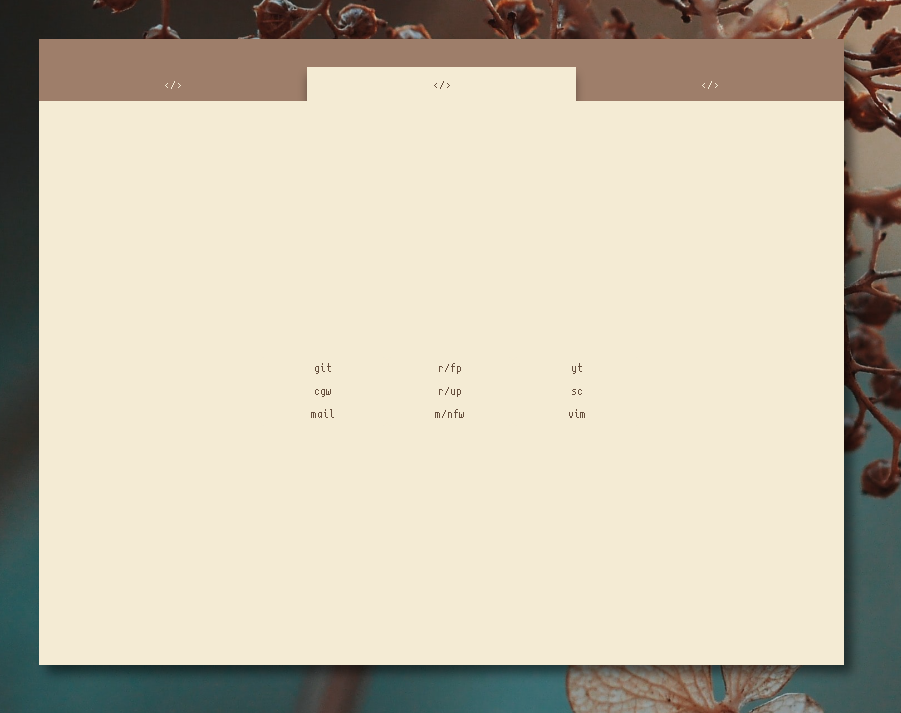
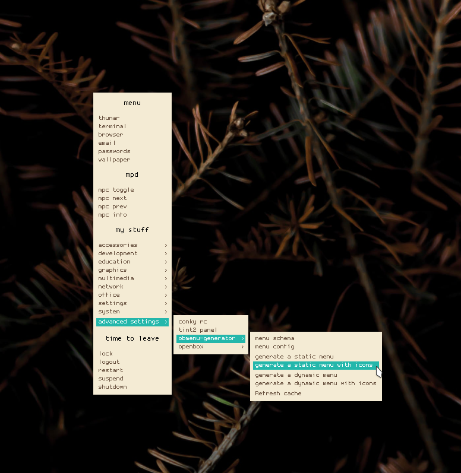

  

<h2 align="center">
    <b>nuaNce's dotfiles</b> 
     
     
    <b> :smile: where else can you find them :smile: </b>
</h2>
 

<h3 align="center">
    <b>Overview</b>
</h3>

Just a minimal openbox setup that syncs with my workflow.

***

***
### Programs used:

**Window Manager:** Openbox

**Terminal:** Alacritty

**Web Browser:** Firefox

**Music Player:** Ncmpcpp

**File Manager:** Thunar

**Statusbar:** Polybar

### Fonts I use:

**Curie [here](https://github.com/NerdyPepper/curie)**

**Scientifica [here](https://github.com/NerdyPepper/scientifica)**

**Some of the bitmap fonts [here](https://addy-dclxvi.github.io/post/bitmap-fonts/)**
***
 
<h3 align="center">Alacritty Config</h3>

 My alacritty config file can be found in the repo at the Alacritty config folder.

***

 
<h3 align="center">Neovim Config</h3>

My Neovim config and plugins are included in the repo, keep in mind that the plugins are suited towards web developement and markdown editing, they may not match your needs, Colorscheme used is mentioned in my reddit post.

***
 
<h3 align="center">Custom Firefox</h3>

My Firefox userChrome is just a modified version of [u/otto251](https://www.reddit.com/user/otto251/)'s ultra-minimal Firefox setup, I have removed some of the rounding and changed the colors and fonts. My startpage is a super fucked up version of one that I found on [r/startpages](https://www.reddit.com/r/startpages/).

Links can be changed by editing the `index.html` file in the `.mozilla/startpage/` folder.
***
 
<h3 align="center">Obmenu Setup</h3>

My preferred obenpox right-click menu is obmenu, menus can be generated using a program called obmenu-generator, here is mine (config and perl scheme included in repo):

`wallpaper` command randomly sets a wallpaper from the `~/Pictures/wallpapers` directory on your computer. `mpc` commands do what their names say, but `mpc info` will open up a small Alacritty window displaying information about the currently playing song. Dependencies for this can be installed with this command:
`sudo pacman -S mpd mpc feh alacritty`

Font used in menu is [Proggy](https://github.com/bluescan/proggyfonts)
***
 
<h3 align="center">Endnotes and license</h3>

If something doesn't work for you as it should or if there is a big, please feel free to create an issue and I will address it as soon as possible.

Licence is GPL, you are free to do whatever you like, no need to credit me or anything.
