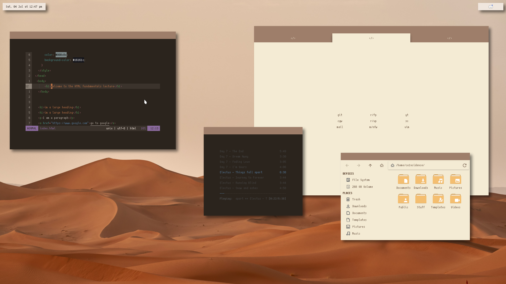
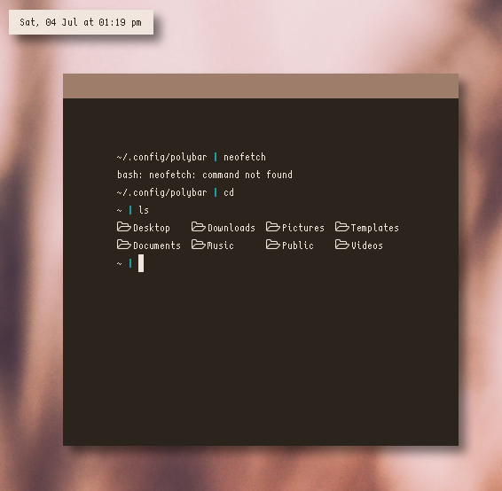
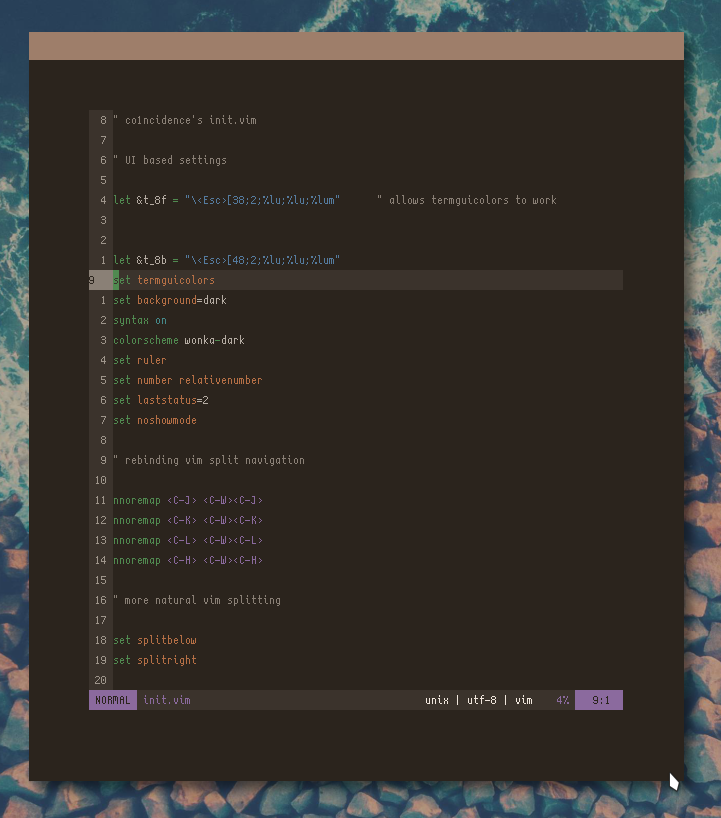

  

<h2 align="center">
    <b>nuaNce's dotfiles</b> 
     
     
    <b>where else can you find them</b>
</h2>
 

<h3 align="center">
    <b>Overview</b>
</h3>

Just a minimal openbox setup that syncs with my workflow

***

***
### Programs used:

**Window Manager:** Openbox

**Terminal:** Alacritty

**Web Browser:** Firefox

**Music Player:** Ncmpcpp

**File Manager:** Thunar

**Statusbar:** Polybar

### Fonts I use:

**Curie [here](https://github.com/NerdyPepper/curie)**

**Scientifica [here](https://github.com/NerdyPepper/scientifica)**

**Some of the bitmap fonts [here](https://addy-dclxvi.github.io/post/bitmap-fonts/)**
***

 
<h3 align="center">Alacritty Config</h3>

 
<h3 align="center">Neovim Config</h3>

